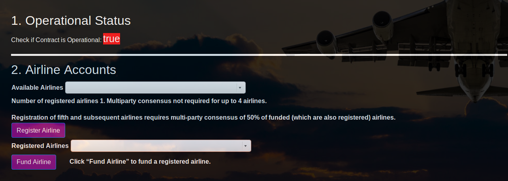
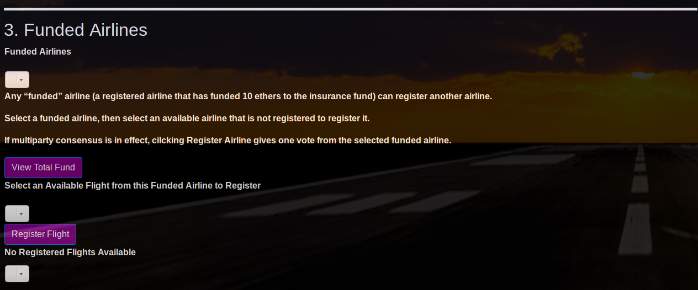
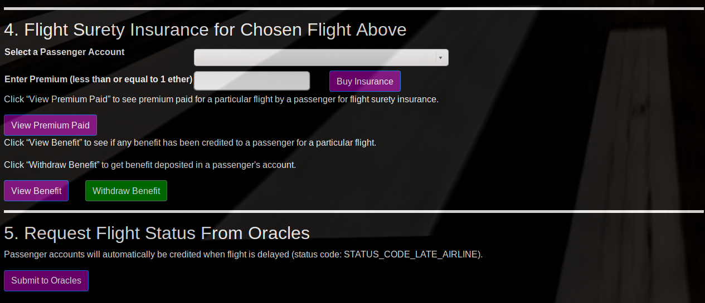

# FlightSurety Project WriteUp

## Introduction
FlightSurety is a sample application project for Udacity's Blockchain course.  It uses smart contracts to implement payout flight delay insurance to travellers. 

## `package.json`

I am unable to download `babel-polyfill`, but I can download `@babel/poly-fill`.  This is used in my `package.json` file.  I then renamed the `poly-fill` folder to `babel-polyfill` and moved it to `node_modules/babel-polyfill` to make the project work.

## Project Assumptions

Multiparty consensus is based on the number of registered airlines, but only funded airlines vote to register an airline.  Use the Register Airline button to vote when multiparty consensus is in effect.

When there are less than four airlines, *any* airline can register *any* other airline.  When there are five or more, and minimum of 50% of the airines (rounded down for an odd number registered airlines) must vote to agree to register an airline.
## Smart contracts

The smart contracts are in the `contracts` folder.  There are:

*   `FlightSuretyApp.sol`
*   `FlightSuretyData.sol`
*   `Migrations.sol`

## Running the Project

First `cd` into the project directory.  Make sure `nodue_modules` are installed

`npm install`

Then complie the contracts:

`truffle compile`

In a separate terminal window, start ganache using mnemoic from truffle.js so ganache can fund those accounts

`ganache-cli --gasLimit 300000000 --gasPrice 20000000000 -m <mnemonic from truffle.js>` -a num_accounts

The truffle.js file specifies the number of accounts to create.

For example:

`ganache-cli --gasLimit 300000000 --gasPrice 20000000000 -m "candy maple cake sugar pudding cream honey rich smooth crumble sweet treat" -a 60`

If using GUI, change gas limit from 6721975 to 300000000, change mnemonic in truffle.js to the GUI's corresponding mnemonic, and change url in dapp's config.json file to `http://localhost:7545`.

To migrate the contracts to the local blockchain created by ganache:

`truffle migrate`

## Truffle Tests
All tests are in `flightSurety.js`, to run use the command:

`truffle test ./test/flightSurety.js`  

My tests reflected the required tests as follows:

1. Required Test: setting operational status

    * My Test 1: (multiparty) has correct initial isOperational() value
      
    * My Test 2: (multiparty) can block access to setOperatingStatus() for non-Contract Owner account

    * My Test 3: (multiparty) can allow access to setOperatingStatus() for Contract Owner account

    * My Test 4: (multiparty) can block access to functions using requireIsOperational when operating status is false

2.    Required Test: First airline is registered when contract is deployed.

    *   My Test 5: First airline is registered when contract is deployed
   

3.    Required Test: Airline can be registered, but does not participate in contract until it submits funding of 10 ether
    
    *  My Test 6: (airline) First airline cannot register second Airline using registerAirline() if it is not funded.  This shows airline can be registered, but does not participate in contract until it submits funding of 10 ether
    
    * My Test 7: (airline) First airline can register second airline using registerAirline() after it has funded'

4.    Required Test: Only existing airline may register a new airline until there are at least four airlines registered
 
    * My Test 8: Only existing airline may register a new airline until there are at least four airlines registered

5.    Required Test: Registration of fifth and subsequent airlines requires multi-party consensus of 50% of registered airlines

    * My Test 9. Registration of fifth by fourth airline is not sufficient, requires multi-party consensus of 50% (two) of registered airlines
    
    * My Test 10. Fourth airline cannot vote twice in multi-party consensus when registering airlines
    
    * My Test 11. Registration of fifth by two different airlines is sufficient, fulfills multi-party consensus of 50% (two) of registered airlines
    

6.    Required Test: Passengers may pay up to 1 ether for purchasing flight insurance

    * My Test 14. Passengers may pay up to 1 ether for purchasing flight insurance
    * My Test 15. Passengers may not pay more than 1 ether for purchasing flight insurance
    
7.    Required Test: If flight is delayed due to airline fault, passenger receives credit of 1.5X the amount they paid
     * My Test 21. If flight is delayed due to airline fault, passenger receives credit of 1.5X the amount they paid

8.    Required Test: Passenger can withdraw any funds owed to them as a result of receiving credit for insurance payout
    
    * My Test 22. Passenger can withdraw any funds owed to them as a result of receiving credit for insurance payout.

9.    Other Tests: The following tests some intermediate steps for buying flight insurance that does not fit into the above categories.
    * My Test 12. Airline can register a flight in the future.
    * My Test 13. Airline cannot register a flight in the past.
    * My Test 16. Passengers may not pay more than once for flight insurance

10.  Oracle Tests: The following tests relate to the oracles.  They make sure the oracle functions and process is working as it should.

    * My Test 17. Register more than 20 oracles, this test uses ${NUM_ORACLES}.
    * My Test 18. OracleRequest event is emitted
    * My Test 19. Oracles can submit response and emit OracleReport event only if oracle's indices contain the index in emitted event.
    * My Test 20. Oracles can submit delay status (STATUS_CODE_LATE_AIRLINE) and emit FlightStatusInfo event.
    

## Client
Run dapp, first change to the `src/dapp` folder, then use the command:

`npm run dapp`

To view dapp, open:

`http://localhost:8000`

## Server

To run the serve, first change to the `src/server` folder, then use the command:

`npm run server`

## Front-end Description

The front-end is implemented in the `src/dapp'.  The main files are:

*   `contract.js`: this file contains the necessary code to interact with the smart contracts.
*   `index.js`: this file implements event listeners for the front end
*   `index.html`: this file contains the html code making up the front end.

The front-end html page has the following sections:

1. Operational Status
    *  Shows whether the data contract is operational.
    
2. Airline Accounts
    *   Shows a list of available airlines.  Press the Register Airline button to register an available airline, a funded airline must be selected, see section 3.  Press the Fund Airline button to fund a registered airline.
    
3. Funded Airlines
    *  This section provids a list of funded airlines, select them and press Register Airline to register an available airline.  When multiparty consensus is in effect, the Register Airline button gives one vote from the selected funded airline.  The funded airlines flights are also shown in the respective drop down, and these flights can be registered for flight surety insurance.
   
4. Flight Surety Insurance for Choose Flight Above
    * This section provides a list of passenger accounts, and allows each passenger account to pay insurance premium, view how much insurance premium was paid, view how much benefit is credited (not withdrawn), and withdraw the benefit.
    
5. Request Flight Status From Oracles
    *  This section provides a button which when pressed will trigger the registered oracles to submit the flight's status for the flight selected in section 3's registered flights drop down.

Below are screenshots showing what the front end website looks like.

## Resources
* Code from various github accounts relating to this project have been consulted.
* [project FAQ](https://medium.com/@andresaaap/flightsurety-project-faq-udacity-blockchain-b4bd4fb03320)
* [How does Ethereum work anyway?](https://medium.com/@preethikasireddy/how-does-ethereum-work-anyway-22d1df506369)
* [BIP39 Mnemonic Generator](https://iancoleman.io/bip39/)
* [Truffle Framework](http://truffleframework.com/)
* [Ganache Local Blockchain](http://truffleframework.com/ganache/)
* [Remix Solidity IDE](https://remix.ethereum.org/)
* [Solidity Language Reference](http://solidity.readthedocs.io/en/v0.4.24/)
* [Ethereum Blockchain Explorer](https://etherscan.io/)
* [Web3Js Reference](https://github.com/ethereum/wiki/wiki/JavaScript-API)
